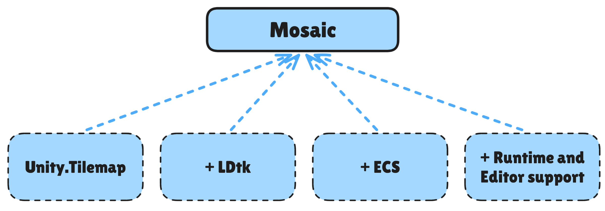

# Mosaic
Mosaic is a Next Gen Runtime Unity Tilemap solution, heavily inspired by LDtk, built using Entity Component System.



| Feature            | Unity.Tilemap                                                                 | Mosaic                                                                                                                                                                                                   |
|--------------------|-------------------------------------------------------------------------------|----------------------------------------------------------------------------------------------------------------------------------------------------------------------------------------------------------|
| Rule engine        | RuleTile: very shallow support, requires custom code to achieve basic results | IntGrid: inspired by LDtk, one of the most powerful and feature rich rule engines                                                                                                                        |
| Dual-Grid System   | No support                                                                    | A simple toggle on the `IntGridDefinition` to enable Dual-Grid system. Rule Matrix editor will be adjusted accordingly                                                                                   |
| Terrain            | No option to merge multiple Tilemap layers into a single mesh using a shader  | `TilemapTerrainAuthoring` allows you to have unlimited number of `IntGrid` with a limited number of them being blended using a dedicated shader                                                          |
| GUI                | Poor GUI experience with RuleTile custom editor                               | Custom GUI made with UI Toolkit, with a separate EditorWindow to make GUI even more clear and concise. Custom rule pattern matrix controls and rendering                                                 |
| Performance        | Main thread only, really inefficient when using complex rule patterns         | 99% 'bursted' and 'jobified'. Main thread only applies mesh changes. All of the systems are optimized to the edge                                                                                        | 
| Allocations        | Huge GC spikes when using RuleTile                                            | 0 GC allocations                                                                                                                                                                                         |
| Random             | No option to set a seed                                                       | `SetGlobalSeed()` and 100% deterministic                                                                                                                                                                 |
| World editing      | Tilemap saves changes in the editor                                           | `TilemapAuthoring` does not save editor data for now. However, adding such feature is trivial as all the data is stored as `IntGridValue`s, which is just a wrapper for `short`                          |
| Grid types         | Rectangular, hexagonal and isometric                                          | Only rectangular                                                                                                                                                                                         |
| Object rule result | Instantiates GameObjects, which is really expensive. A lot of GC allocations  | Instantiates Entities, which is really cheap. No GC allocations                                                                                                                                          |                  
| Rendering Pipeline | Internal `SpriteRenderer` based rendering path                                | `Entities.Graphics` based rendering with every `IntGridAuthoring` being a separate entity with a mesh. Utilizing `RuntimeMaterial` to create materials at runtime with different main textures as needed |                                                                                                                                                                                                                               
| 2D Rendering       | Supports both 3D and 2D rendering with SortingLayers                          | Because `SpriteRenderer` rendering path is internal, Mosaic only works with 3D based rendering                                                                                                           |

## Changelog
Full changelog can be found [here](CHANGELOG.md)

## Installation
Add these packages using git urls in a package manager:
1. FireAlt.Core: https://github.com/Fire-Aalt/com.firealt.core.git
2. FireAlt.Mosaic: https://github.com/Fire-Aalt/com.firealt.mosaic.git

Add these packages for optional support for runtime `IntGrid` debugging: 
1. BovineLabs.Core: https://gitlab.com/tertle/com.bovinelabs.core.git
2. BovineLabs.Anchor: https://gitlab.com/tertle/com.bovinelabs.anchor.git
3. BovineLabs.Quill: https://github.com/tertle/com.bovinelabs.quill

## Workflow
### Editor (Single Grid workflow)
To start, we need 2 things: `IntGrid` and `RuleGroup` ScriptableObjects

Create IntGrid using "Create/Mosaic/IntGrid". This is how we can configure it:


*You can add a texture to be displayed instead of a color. Use create RuleGroup button to quickly create RuleGroup ScriptableObject*

Open RuleGroup ScriptableObject and add some rules to it like this:


*Every parameter has a tooltip*

To edit the rule pattern, click on the matrix of the rule matrix preview of the rule. This window will pop up:

Here you can modify rule matrix pattern and add or remove results. All the results are weighted, where more weight means more chance to be selected. You can have both sprite and entity to be rendered/spawned.

Next add `GridAuthoring` component to a GameObject in a SubScene and add a `TilemapAuthoring` as a child to Grid. Configure them as needed.

### Editor (Dual-Grid workflow)

For Dual-Grid to work, a "Use Dual Grid" checkbox has to be ticked at the top of `IntGridDefinition`. This will change the serialized IntGriMatrix to Dual-Grid one and the authoring inspectors will also be changed for all the RuleGroups assign to that `IntGridDefinition`.


### Tilemap Terrain
Works the same as having multiple `TilemapAuthoring` separately, but instead of multiple meshes produces only 1 using a custom shader for blending. 


### Tilemap Cell
Add `TilemapCellAuthoring` to an entity prefab that is used in a rule result if you need to know which `IntGrid` cell spawned it.

This authoring adds a `TilemapCell` component during baking. When Mosaic instantiates the entity at runtime, `TilemapCell.Cell` is set to the spawned cell position (`int2`) on the source `IntGrid`.

### Code
Reference to an `IntGrid`'s `IntGridHash` is required to send commands to `TilemapCommandBufferSystem`. Code is identical for both single grid and Dual-Grid configurations

1. Get a reference to `TilemapCommandBufferSingleton`
```csharp
var tcb = SystemAPI.GetSingleton<TilemapCommandBufferSingleton>();

// You can also set global seed here or do it later
tcb.SetGlobalSeed(seed);
```

2. Use `SetIntGridValue()` to update a referenced `IntGrid`
```csharp
// If you set 0 as IntGridValue you "remove" the position (the same as setting null value using SetTile in Unity.Tilemap)
tcb.SetIntGridValue(topWallsHash, new int2(0, 1), topWallsSolidIntGridValue);
```

3. Use `Clear()` to clear all IntGridValues of a specific `IntGrid` or use `ClearAll()` to clear all `IntGrid`s values
```csharp
tcb.Clear(topWalls);
tcb.ClearAll();
```

*Done!*

## How does RuleEngine work?
A matrix represents IntGridValues to search for with an offset from the center of every single position in the world. 
Controls and what they do are as follows:
1. Left click or "solid" color means that this cell must contain this exact IntGridValue
2. Right click or "canceled" color means that this cell can be anything but not this IntGridValue
3. Double right click removes the cell from cells to search (any IntGridValue is valid)
4. Any Value/No Value do the same as any other IntGridValues, but apply as a yes or no filter to the cell's IntGridValue (if IntGridValue = 1, and the cell is marked No Value, then the rule will not pass)

## Runtime debugging
A separate assembly is included with debug code. This assembly is conditionally compiled out if BovineLabs.Anchor and BovineLabs.Quill are not found in the project. Having BovineLabs.Anchor will add "Mosaic" toolbar to Anchor with a list of registered `IntGrid`s. Having BovineLabs.Quill will add runtime gizmo for selected `IntGrid`s in that list.

## Contribution
If you are interested in using this solution, I will be greatly appreciated. Write any bugs, feature requests or enhancements to Issues tab.

### Special Thanks to:

[LDtk](https://ldtk.io/) for the idea and GUI
