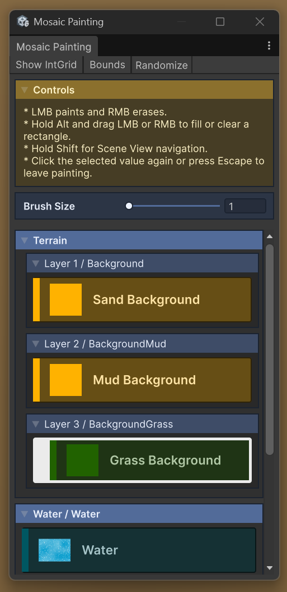
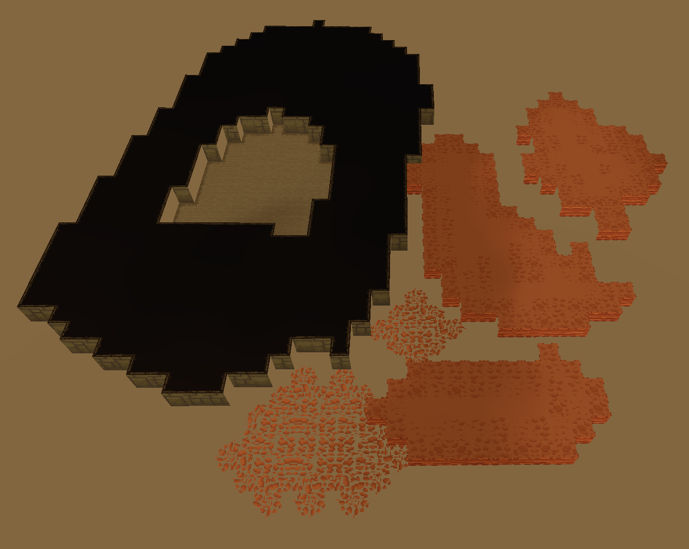
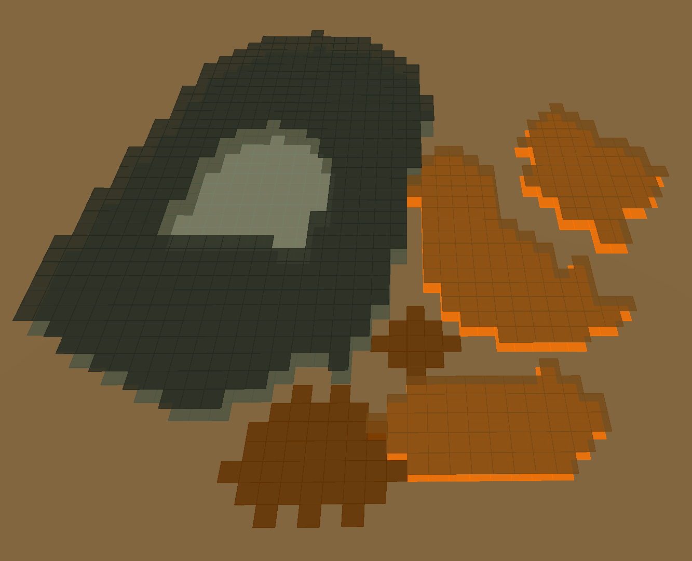
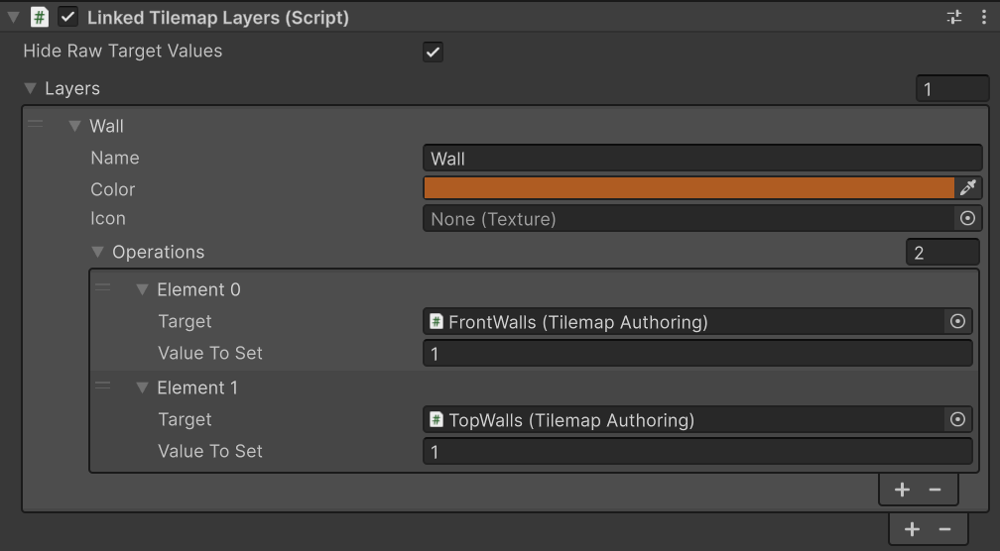

# Mosaic
Mosaic is a Next Gen Unity Rule-based Tilemap solution, heavily inspired by LDtk, built using Entity Component System.


| Feature               | Unity.Tilemap                                                                | Mosaic                                                                                                                                                                                                   |
|-----------------------|------------------------------------------------------------------------------|----------------------------------------------------------------------------------------------------------------------------------------------------------------------------------------------------------|
| Rule engine           | RuleTile: very shallow support, requires custom code to achieve basic results | IntGrid: inspired by LDtk, one of the most powerful and feature rich rule engines                                                                                                                        |
| Dual-Grid Tilemap     | No support                                                                   | A simple toggle on the `IntGridDefinition` to enable Dual-Grid system. Rule Matrix editor will be adjusted accordingly                                                                                   |
| Terrain               | No option to merge multiple Tilemap layers into a single mesh using a shader | `TilemapTerrainAuthoring` allows you to have unlimited number of `IntGrid` with a limited number of them being blended using a dedicated shader                                                          |
| GUI                   | Poor GUI experience with RuleTile custom editor                              | Custom GUI made with UI Toolkit, with a separate EditorWindow to make GUI even more clear and concise. Custom rule pattern matrix controls and rendering                                                 |
| World editing         | Tilemap saves changes in the editor                                          | `TilemapAuthoring` and `TilemapTerrainAuthoring` persist sparse IntGrid cells painted with the Mosaic Painting window with extensive support for Editor level editing                                    |
| Performance           | Main thread only, really inefficient when using complex rule patterns        | 99% 'bursted' and 'jobified'. Main thread only applies mesh changes. All of the systems are optimized to the edge                                                                                        | 
| Allocations           | Huge GC spikes when using RuleTile                                           | 0 GC allocations                                                                                                                                                                                         |
| Random                | No option to set a seed                                                      | `SetGlobalSeed()` and 100% deterministic                                                                                                                                                                 |
| Grid types            | Rectangular, hexagonal and isometric                                         | Only rectangular                                                                                                                                                                                         |
| Object rule result    | Instantiates GameObjects, which is really expensive. A lot of GC allocations | Instantiates Entities, which is really cheap. No GC allocations                                                                                                                                          |                  
| Rendering Pipeline    | Internal `SpriteRenderer` based rendering path                               | `Entities.Graphics` based rendering with every `IntGridAuthoring` being a separate entity with a mesh. Utilizing `RuntimeMaterial` to create materials at runtime with different main textures as needed |                                                                                                                                                                                                                               
| 2D Rendering          | Supports both 3D and 2D rendering with SortingLayers                         | Only supports 3D based rendering                                                                                                                                                                         |
| Unity CLI integration | No explicit support                                                          | 3 commands for debugging and agentic workflows: `mosaic_targets`, `mosaic_get_target`, `mosaic_paint`                                                                                                    |

## Changelog
Full changelog can be found [here](CHANGELOG.md)

## Installation
Add these packages using git urls in a package manager:
1. FireAlt.Core: https://github.com/Fire-Aalt/com.firealt.core.git
2. FireAlt.Mosaic: https://github.com/Fire-Aalt/com.firealt.mosaic.git

Add these packages for optional support for runtime `IntGrid` debugging: 
1. BovineLabs.Core: https://gitlab.com/tertle/com.bovinelabs.core.git
2. BovineLabs.Anchor: https://gitlab.com/tertle/com.bovinelabs.anchor.git
3. BovineLabs.Quill: https://github.com/tertle/com.bovinelabs.quill

## Workflow
### Editor (Single Grid workflow)
To start, we need 2 things: `IntGrid` and `RuleGroup` ScriptableObjects

Create IntGrid using "Create/Mosaic/IntGrid". This is how we can configure it:

<p align="center">
 
</p>

*You can add a texture to be displayed instead of a color. Use create RuleGroup button to quickly create RuleGroup ScriptableObject*

Open RuleGroup ScriptableObject and add some rules to it like this:
<p align="center">
 
</p>
*Every parameter has a tooltip*

To edit the rule pattern, click on the matrix of the rule matrix preview of the rule. This window will pop up:

<p align="center">
 
</p>

Here you can modify rule matrix pattern and add or remove results. All the results are weighted, where more weight means more chance to be selected. You can have both sprite and entity to be rendered/spawned.

Next add `GridAuthoring` component to a GameObject in a SubScene and add a `TilemapAuthoring` as a child to Grid. Configure them as needed.

### Painting IntGrids

Open the SubScene which contains the Mosaic tilemap components and select the Mosaic Tool in Scene View. 
You can also paint in Prefab isolation mode, or in context Prefab Mode when the Prefab instance belongs to a SubScene. 
Tilemaps in a normal Scene and native ECS tilemaps from a closed SubScene are not editable. Closed SubScene tilemaps remain available to the preview controls such as "Show Bounds" and "Show IntGrid".

The palette follows the Hierarchy order. `TilemapAuthoring` values, `TilemapTerrainAuthoring` layers and linked layers are grouped into separate foldouts. 
Right-click a value and select **Go to Layer** to find its authoring component in the Inspector.

<p align="center">
 
</p>

Select an IntGrid value and paint in the Scene View:

* LMB paints and RMB erases.
* Drag to paint or erase continuously. Crossed cells are filled without gaps.
* Hold `Alt` and drag LMB or RMB to fill or clear a rectangle. Rectangle painting ignores Brush Size.
* Hold `Shift` to use normal Scene View navigation.
* Press `Escape`, or click the selected value again, to leave painting and restore the previous editor tool.

Brush Size controls a circular brush from 1 to 10. A size of 1 paints one cell. The Scene View preview shows the cells which will be affected, including cells hidden behind other geometry. Every drag or rectangle is recorded as one Undo operation.

*video*

The toolbar contains the following preview controls:

* `Show IntGrid` replaces the regular tilemap and terrain output with the saved raw IntGrid colors. You can also toggle it with `Shift+R`.
* `Bounds` displays the `RenderBounds` of the Mosaic tilemaps in the Scene View.
* `Randomize` changes the preview seed so weighted RuleEngine results can be checked without changing the painted data.

With `Show IntGrid` disabled, painted values are passed through Mosaic's normal RuleEngine, terrain and `Entities.Graphics` presentation path. Sprite, terrain and entity-prefab results therefore match the regular Mosaic output. The window refreshes itself when the current Scene, SubScene, Prefab Stage or relevant authoring data changes.

<p align="center">
 
 
</p>

*Image A: default output view mode. Image B: "Show IntGrid" turned on which shows raw `IntGridValue` colors.*

Painted cells are stored on `TilemapAuthoring` and `TilemapTerrainAuthoring`. Large filled areas are packed into rectangles to keep Scene and Prefab files small. Prefab overrides, Scene dirty state and Undo are handled automatically.

### Linked Tilemap Layers (Editor Only)

Add `LinkedTilemapLayers` to a GameObject in the same open SubScene or Prefab Stage as the Tilemaps you want to paint. 
It is only needed to help with complex painting setups where more than 1 tilemaps are needed for a given visual effect.

Add an entry to **Layers** for every combined palette value:

1. Set the layer name, color and optional icon. These are displayed in the Painting window.
2. Add an entry to **Operations** for every `TilemapAuthoring` which should change together.
3. Assign the target Tilemap and the IntGrid value to set. Use 0 when painting this linked layer should remove the cell from that target.
4. Put the Tilemap which defines the painting plane in the first operation. The first operation is the anchor and still receives its configured value.

When the linked value is selected, LMB applies every operation to the same anchor cell. 
RMB always clears the cell from every operation target, including targets whose configured LMB value is not 0.

Enable **Hide Raw Target Values** when those Tilemaps should only be painted through linked layers. 
This removes their individual IntGrid values from the palette without removing the linked entries.

<p align="center">
 
</p>

### Editor (Dual-Grid workflow)

For Dual-Grid to work, a "Use Dual Grid" checkbox has to be ticked at the top of `IntGridDefinition`. This will change the serialized IntGriMatrix to Dual-Grid one and the authoring inspectors will also be changed for all the RuleGroups assign to that `IntGridDefinition`.

<p align="center">
 
</p>

### Tilemap Terrain
Works the same as having multiple `TilemapAuthoring` separately, but instead of multiple meshes produces only 1 using a custom shader for blending. 

<p align="center">
 
</p>

### Tilemap Cell
Add `TilemapCellAuthoring` to an entity prefab that is used in a rule result if you need to know which `IntGrid` cell spawned it.

This authoring adds a `TilemapCell` component during baking. When Mosaic instantiates the entity at runtime, `TilemapCell.Cell` is set to the spawned cell position (`int2`) on the source `IntGrid`.

### Code
Reference to an `IntGrid`'s `IntGridHash` is required to send commands to `TilemapCommandBufferSystem`. Code is identical for both single grid and Dual-Grid configurations

1. Get a reference to `TilemapCommandBufferSingleton`
```csharp
var tcb = SystemAPI.GetSingleton<TilemapCommandBufferSingleton>();

// You can also set global seed here or do it later
tcb.SetGlobalSeed(seed);
```

2. Use `SetIntGridValue()` to update a referenced `IntGrid`
```csharp
// If you set 0 as IntGridValue you "remove" the position (the same as setting null value using SetTile in Unity.Tilemap)
tcb.SetIntGridValue(topWallsHash, new int2(0, 1), topWallsSolidIntGridValue);
```

3. Use `Clear()` to clear all IntGridValues of a specific `IntGrid` or use `ClearAll()` to clear all `IntGrid`s values
```csharp
tcb.Clear(topWalls);
tcb.ClearAll();
```

*Done!*

## How does RuleEngine work?
A matrix represents IntGridValues to search for with an offset from the center of every single position in the world. 
Controls and what they do are as follows:
1. Left click or "solid" color means that this cell must contain this exact IntGridValue
2. Right click or "canceled" color means that this cell can be anything but not this IntGridValue
3. Double right click removes the cell from cells to search (any IntGridValue is valid)
4. Any Value/No Value do the same as any other IntGridValues, but apply as a yes or no filter to the cell's IntGridValue (if IntGridValue = 1, and the cell is marked No Value, then the rule will not pass)

## Runtime debugging
A separate assembly is included with debug code. This assembly is conditionally compiled out if BovineLabs.Anchor and BovineLabs.Quill are not found in the project. Having BovineLabs.Anchor will add "Mosaic" toolbar to Anchor with a list of registered `IntGrid`s. Having BovineLabs.Quill will add runtime gizmo for selected `IntGrid`s in that list.

## Contribution
If you are interested in using this solution, I will be greatly appreciated. Write any bugs, feature requests or enhancements to Issues tab.

### Special Thanks to:

[LDtk](https://ldtk.io/) for the inspiration and GUI.
